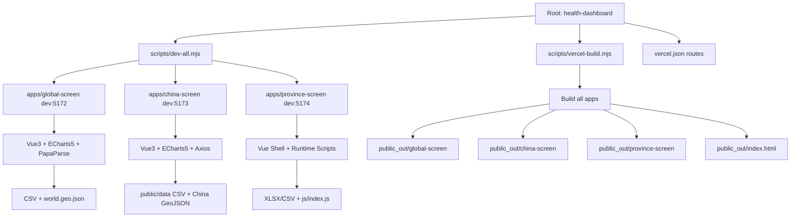

# 可视化大屏项目技术设计文档

## 1. 文档目标与范围

本文档用于说明当前可视化大屏项目（全球/全国/各省三屏）**已实现**的技术架构、模块设计、核心代码逻辑、依赖与部署方式。  
约束如下：
- 仅描述现有实现，不引入新技术方案；
- 不修改任何既有代码逻辑、UI 交互或部署结构；
- 可补充“未进行的优化/调整建议”作为后续参考。

## 2. 技术架构

## 2.1 总体架构（前端）

- 架构形态：Monorepo 前端多应用架构；
- 根目录统一编排运行与构建脚本；
- 三个子应用分别独立开发、独立构建、统一部署输出；
- 无后端服务，数据链路为静态文件读取 + 前端解析 + ECharts 渲染。

目录结构（现状）：

```text
health-dashboard/
├── apps/
│   ├── global-screen/
│   ├── china-screen/
│   └── province-screen/
├── scripts/
│   ├── dev-all.mjs
│   └── vercel-build.mjs
├── index.html
├── package.json
└── vercel.json
```

## 2.2 三屏技术实现差异

- **global-screen**
  - Vue 3 + Vite + ECharts 5（模块化引入）；
  - `papaparse` 解析 CSV；
  - 地图数据采用本地 `world.geo.json`，失败可回退远程 geojson。
- **china-screen**
  - Vue 3 + Vite + ECharts 5；
  - `axios` 加载 `public/data` CSV；
  - 中国地图来自 `echarts-countries-js` 的 raw geojson。
- **province-screen**
  - Vue 3 页面壳 + 运行时动态加载外部脚本（ECharts 4 / jQuery / XLSX）；
  - 图表主体逻辑位于 `public/js/index.js`；
  - 核心数据来源为 `public/data/*.xlsx`（地图支持 csv 降级）。

## 2.3 数据链路

数据链路统一模式：
1. 页面挂载后加载静态资源（CSV/XLSX/GeoJSON）；
2. 前端解析与字段映射；
3. 组装 ECharts option；
4. 渲染并响应时间轴/播放/resize 交互；
5. 局部页面支持定时刷新（global-screen：15s）。

## 2.4 构建与部署链路

- 根脚本 `vercel-build` 调用 `scripts/vercel-build.mjs`；
- 逐个安装与构建三屏应用；
- 汇总产物到 `public_out/{global-screen|china-screen|province-screen}`；
- 复制根 `index.html` 到 `public_out/index.html`；
- Vercel 从 `public_out` 读取静态产物并按 `vercel.json` 路由分发。

---

## 3. 模块设计

## 3.1 根级编排模块

### 3.1.1 本地并行启动模块（`scripts/dev-all.mjs`）
- 职责：
  - 启动前清理 5172/5173/5174 端口占用；
  - 并行启动 global/china/province 三个 Vite dev server；
  - 统一监听退出并执行子进程回收。
- 输入：无；
- 输出：三个本地地址可访问（5172/5173/5174）。

### 3.1.2 构建打包模块（`scripts/vercel-build.mjs`）
- 职责：
  - 按 app 顺序安装依赖并构建；
  - 优先 `npm ci`，失败回退 `npm install`；
  - 统一拷贝 dist 到 `public_out`；
  - 补充 global-screen 运行时依赖 CSV 到输出目录。
- 输入：根目录与 apps 内现有工程文件；
- 输出：可部署静态目录 `public_out`。

## 3.2 global-screen 模块设计

- **数据请求与解析模块**
  - `loadCsvRows`：候选路径逐个尝试；
  - `sanitizeCsvRows`：处理 BOM 和 header 清洗；
  - `computeMetrics`：计算顶部 KPI 目标值；
  - `ensureWorldMap`：注册世界地图。
- **图表渲染模块**
  - `setWorldHeatMap`（世界热力图）；
  - `setLisaMap`（LISA 聚类地图）；
  - `setWhoGapChart`、`setTrendChart`、`setRiskDonutChart`、`setStackChart`、`setRadarChart`、`setRegionPieChart`。
- **交互控制模块**
  - 时间轴播放/暂停：`togglePlay`；
  - 年份变更：`onYearChange`；
  - 页面缩放：`handleResize`；
  - 定时刷新：`refreshTimer`（15 秒）。

## 3.3 china-screen 模块设计

- **数据加载模块**
  - `loadData` 并发请求 5 个 CSV（`asset('data/...')`）。
- **图表生命周期模块**
  - `safeInit` 按容器尺寸懒初始化；
  - `initCharts` 注册中国地图并创建实例；
  - `drawAll` 按当前年份统一更新地图和多图；
  - `attachResize` 监听窗口变化并批量 `resize`。
- **业务联动模块**
  - `state.year` 与 `watch` 联动重绘；
  - `startPlay` 轮播年份；
  - 跨屏跳转按钮按 DEV/PROD 双环境分流。

## 3.4 province-screen 模块设计

- **页面壳模块（Vue）**
  - 提供顶部时间、页面容器与跨屏按钮；
  - 运行时顺序加载第三方与业务脚本。
- **脚本渲染模块（`public/js/index.js`）**
  - `map()`：地图热力图 + 年份滑块；
  - `qipao()`：耦合度时间序列气泡图；
  - `leidatu()`：雷达图；
  - `wuran()`：D 值 TOP10 排行；
  - `huaxing()`：OTE 均值 TOP10 排行；
  - `zhexian()`：区域指标趋势双面板折线图。
- **数据解析模块**
  - XLSX 首选，必要时 CSV 回退；
  - 省份名归一化；
  - 年份提取与数据聚合。

---

## 4. 核心代码逻辑（现有实现片段）

以下片段为现有项目关键逻辑摘录（原实现语义）。

### 4.1 根级并行启动逻辑（端口清理 + 三屏并发）

```javascript
const ports = [5172, 5173, 5174]
...
await freePorts()

for (const cmd of commands) {
  const child = spawn(npmCmd, ['run', 'dev'], {
    cwd: cmd.cwd,
    stdio: 'inherit',
    shell: process.platform === 'win32'
  })
  processes.push(child)
}
```

### 4.2 构建脚本中的安装策略（ci 优先，install 回退）

```javascript
const ciResult = tryRun('npm', ['ci'], appDir)
if (ciResult.status !== 0) {
  console.warn(`[vercel-build] npm ci failed in ${app.source}, fallback to npm install`)
  run('npm', ['install'], appDir)
}

run('npm', ['run', 'build'], appDir)
```

### 4.3 global-screen 世界地图数据绑定（D 值）

```javascript
const yearRows = healthRows.value.filter((r) => Number(r.year) === Number(currentYear.value))
const data = yearRows.map((r) => ({ name: r.country, value: parseNumeric(r.D_Value) }))
...
formatter: ({ name, value }) => {
  const row = yearRows.find((r) => r.country === name)
  if (!row) return `${name}<br/>D值: 0`
  return `${name}<br/>D值: ${parseNumeric(value).toFixed(3)}<br/>预期寿命: ${parseNumeric(row.U3_Life_Expectancy).toFixed(2)}`
}
```

### 4.4 china-screen 数据并发加载（子路径适配）

```javascript
const asset = (relativePath) => `${import.meta.env.BASE_URL}${relativePath}`;

const [a, c, u, r, m] = await Promise.all([
  axios.get(asset('data/province_aging_rate.csv')),
  axios.get(asset('data/population_center_shift.csv')),
  axios.get(asset('data/u3_health_resource_allocation.csv')),
  axios.get(asset('data/resident_health_indicators.csv')),
  axios.get(asset('data/medical_health_indicators.csv'))
]);
```

### 4.5 province-screen 脚本顺序加载

```javascript
const urls = [
  'https://cdnjs.cloudflare.com/ajax/libs/echarts/4.3.0/echarts.min.js',
  'https://cdnjs.cloudflare.com/ajax/libs/jquery/1.10.2/jquery.min.js',
  'https://cdn.jsdelivr.net/npm/xlsx@0.18.5/dist/xlsx.full.min.js',
  `${import.meta.env.BASE_URL}js/china.js`,
  `${import.meta.env.BASE_URL}js/index.js`
]
```

---

## 5. 依赖说明

## 5.1 根项目依赖形态

- 根 `package.json` 不维护业务库依赖，仅维护脚本入口：
  - `dev:all`
  - `vercel-build`

## 5.2 global-screen 依赖

- 运行依赖：
  - `vue`
  - `echarts`
  - `papaparse`
  - `@kjgl77/datav-vue3`
- 开发依赖：
  - `vite`
  - `@vitejs/plugin-vue`
  - `concurrently`
  - `kill-port`

## 5.3 china-screen 依赖

- 运行依赖：
  - `vue`
  - `axios`
  - `echarts`
  - `echarts-countries-js`
- 开发依赖：
  - `vite`
  - `@vitejs/plugin-vue`
  - `patch-package`

## 5.4 province-screen 依赖

- 运行依赖：
  - `vue`
- 开发依赖：
  - `vite`
  - `@vitejs/plugin-vue`
- 运行时外链依赖（页面脚本动态加载）：
  - ECharts 4 CDN
  - jQuery CDN
  - XLSX CDN

---

## 6. 部署与运行说明（现状）

## 6.1 本地运行

- 单屏启动：
  - `npm run dev:global`
  - `npm run dev:china`
  - `npm run dev:province`
- 三屏联调：
  - `npm run dev:all`
- 端口：
  - 5172（global）
  - 5173（china）
  - 5174（province）

## 6.2 构建流程

- 命令：`npm run vercel-build`
- 输出：
  - `public_out/global-screen/`
  - `public_out/china-screen/`
  - `public_out/province-screen/`
  - `public_out/index.html`

## 6.3 Vercel 配置

- Root Directory: `./`
- Build Command: `npm run vercel-build`
- Output Directory: `public_out`
- 路由能力（`vercel.json`）：
  - 兼容旧路径 `bigbig_screen/two_bigscreen/screen` 到新路径；
  - 子路径 SPA 回退到各自 `index.html`；
  - 根路径落到 `index.html`。

---

## 7. 未进行的优化/调整建议

以下为在不改变现有功能前提下，可后续评估的技术改进方向：

### 7.1 架构与模块层
- 将 `province-screen` 外链脚本逐步内聚到模块化构建链路，减少运行时外部依赖波动。
- 三屏共用工具函数（时间格式化、数据容错、颜色映射）可抽取为共享 utilities。

### 7.2 性能层
- 大包体页面可进一步拆分图表模块，优化首屏加载体积。
- 高频重绘图表可增加细粒度更新策略，降低 setOption 全量替换成本。

### 7.3 稳定性层
- 为关键数据加载流程增加统一错误码和日志标识，提升线上定位速度。
- 为 `dev-all` 增加可选“仅检测冲突端口”模式，避免误杀无关本地进程。

### 7.4 部署运维层
- 增加部署后健康检查清单（子路径访问、核心数据 200、地图资源 200）。
- 将构建日志输出标准化（按 app 前缀），便于 CI/Vercel 追踪。

---

本文档为当前项目实现的技术设计快照，仅用于描述现状，不作为功能变更说明。

## 附录: 技术架构图说明文字（答辩版）

以下文字可直接配合你的架构图使用，作为“讲图稿”。

### A. 总体技术架构图说明

本系统采用前端 Monorepo 多应用架构，根目录负责统一编排，`apps` 目录承载三套独立页面：全球、全国、各省。  
在运行形态上，开发环境通过 `dev-all` 同时拉起三个 Vite 服务，分别占用 5172/5173/5174 端口；生产环境通过 `vercel-build` 统一构建并输出到 `public_out`，再由 Vercel 进行静态托管与子路径路由分发。  
数据链路为“静态文件 -> 前端解析 -> 图表渲染”，不依赖后端实时接口。全球/全国页面以 Vue + ECharts 为主，各省页面采用 Vue 页面壳 + 外链脚本渲染模式。

### B. 分层架构图说明

可将系统划分为四层：

1. **展示层（Presentation）**
   - 三个大屏页面的布局、主题样式、图表容器与交互控件；
   - 负责用户可见内容与页面间跳转入口。

2. **交互控制层（Interaction Control）**
   - 年份滑块、播放/暂停、跨屏切换、窗口 resize 监听；
   - 将用户操作转化为状态变更并触发重绘。

3. **数据处理层（Data Processing）**
   - CSV/XLSX/GeoJSON 加载、字段映射、聚合计算、容错回退；
   - 产出图表可直接消费的数据结构。

4. **渲染引擎层（Rendering）**
   - ECharts option 组装与实例管理；
   - 执行地图、柱图、折线图、雷达图、桑基图、气泡图等渲染。

### C. 三屏模块关系图说明

- **global-screen（全球）**  
  重点是全球尺度多图联动：KPI、世界热力图、LISA、趋势/结构/风险图；支持年份时间轴、自动播放和定时刷新。

- **china-screen（全国）**  
  重点是全国尺度的“老龄化—资源投入—服务产出”联动：中心中国地图 + 左右六图 + 底部桑基与排行；由统一状态驱动多图同步更新。

- **province-screen（各省）**  
  重点是省域指标展示：热力地图、TOP 排行、气泡、雷达、双面板折线；页面壳控制入口与时钟，图表由 `public/js/index.js` 组织渲染。

### D. 运行时序图说明（页面加载）

可按以下时序讲解：

1. 用户访问页面；
2. 页面加载静态资源与脚本；
3. 初始化状态与图表容器；
4. 拉取数据文件（CSV/XLSX/GeoJSON）；
5. 数据解析与聚合映射；
6. 注册地图并创建 ECharts 实例；
7. 首帧渲染完成；
8. 进入交互循环（年份切换、播放、resize、局部刷新）。

该时序在三屏中一致，差异主要在数据格式和图表组织方式。

### E. 部署时序图说明（Vercel）

部署流程可描述为：

1. 触发 `npm run vercel-build`；
2. 根脚本遍历三个子应用执行安装与构建；
3. 汇总 dist 到 `public_out/{global-screen|china-screen|province-screen}`；
4. 复制根 `index.html` 到 `public_out`；
5. Vercel 读取 `public_out` 发布；
6. `vercel.json` 执行旧路径重定向与子路径路由回退。

### F. 架构图讲解要点（答辩口径）

- 本项目是“**单仓多前端应用**”而非“单页多路由应用”；
- 三屏技术路线一致，但各省页面保留历史脚本驱动实现；
- 系统核心能力是“静态数据可视化表达与跨屏展示”，不包含后端业务服务；
- 工程上已实现开发并行启动、统一构建输出和子路径部署兼容。

## 8. 详细架构补充（借鉴格式扩展）

## 8.1 系统架构图（现有实现映射）



## 8.2 文件结构说明（技术视角）

```text
health-dashboard/
├── apps/
│   ├── global-screen/
│   │   ├── src/App.vue
│   │   ├── public/world.geo.json
│   │   └── package.json
│   ├── china-screen/
│   │   ├── src/App.vue
│   │   ├── public/data/*.csv
│   │   └── package.json
│   └── province-screen/
│       ├── src/App.vue
│       ├── public/js/index.js
│       ├── public/js/china.js
│       ├── public/css/*.css
│       ├── public/data/*.xlsx
│       └── package.json
├── scripts/
│   ├── dev-all.mjs
│   └── vercel-build.mjs
├── vercel.json
├── requirements.md
└── design.md
```

## 8.3 组件与接口设计（按现有代码职责）

### 8.3.1 根级编排组件

- **DevOrchestrator（`scripts/dev-all.mjs`）**
  - 关键职责：
    - 释放 5172/5173/5174 端口；
    - 并发启动三屏 `npm run dev`；
    - 统一退出信号与子进程清理。
  - 关键接口：
    - `freePorts()`
    - `runAndWait(command, args)`
    - `shutdown(code)`

- **BuildOrchestrator（`scripts/vercel-build.mjs`）**
  - 关键职责：
    - 逐 app 安装与构建；
    - `npm ci` 失败回退 `npm install`；
    - 汇总产物到 `public_out`；
    - 拷贝 global-screen 依赖 CSV 与根入口页。
  - 关键接口：
    - `tryRun(command, args, cwd)`
    - `run(command, args, cwd)`

### 8.3.2 global-screen 组件划分

- **DataLoader**
  - `loadCsvRows()`, `sanitizeCsvRows()`, `hasRequiredFields()`
- **MapService**
  - `ensureWorldMap()`, `setWorldHeatMap()`, `setLisaMap()`
- **ChartService**
  - `setWhoGapChart()`, `setTrendChart()`, `setRiskDonutChart()`, `setStackChart()`, `setRadarChart()`, `setRegionPieChart()`
- **InteractionController**
  - `togglePlay()`, `onYearChange()`, `handleResize()`, `refreshDataWithMotion()`

### 8.3.3 china-screen 组件划分

- **DataProvider**
  - `loadData()`（并行加载 5 个 CSV）
- **StateController**
  - `state.year` / `watch` / `startPlay()`
- **MapAndChartRenderer**
  - `initCharts()`, `mapOption()`, `drawAll()`, `scheduleDrawAll()`
- **ViewportAdapter**
  - `updateScale()`, `attachResize()`, `safeInit()`

### 8.3.4 province-screen 组件划分

- **ShellController（`src/App.vue`）**
  - 页面壳、时钟、跨屏跳转、脚本加载
- **LegacyChartRuntime（`public/js/index.js`）**
  - `map()`, `qipao()`, `leidatu()`, `wuran()`, `huaxing()`, `zhexian()`
- **DataParser**
  - XLSX/CSV 解析、年份提取、省份归一化、聚合计算

## 8.4 数据模型（按现有数据结构抽象）

### 8.4.1 GlobalHealthRow（来自 `health_datas.csv`）

```javascript
{
  country: string,
  year: number,
  U1_Score: number,
  U2_Score: number,
  U3_Score: number,
  D_Value: number,
  U3_Life_Expectancy: number,
  U3_Health_Expenditure_pct_GDP_pct_of_GDP: number,
  Under5_Mortality_Rate: number,
  DPT_Immunization_Coverage: number
}
```

### 8.4.2 ChinaScreenState（`china-screen/src/App.vue`）

```javascript
{
  ready: boolean,
  year: number,
  play: boolean,
  cards: {
    aging: number,
    expense: number,
    life: number,
    distance: number
  },
  raw: {
    aging: Array<object>,
    center: Array<object>,
    u3: Array<object>,
    resident: Array<object>,
    medical: Array<object>
  }
}
```

### 8.4.3 ProvinceMapPoint（`province-screen/public/js/index.js`）

```javascript
{
  name: string,         // 省份名
  value: [yearIdx, provinceIdx, score], // 气泡图坐标与值
  year: string,
  rawValue: number
}
```

## 8.5 正确性属性（基于当前成品）

1. **跨屏可达性属性**  
   在三屏任意页面点击已有切换按钮，应能跳转到目标屏的开发端口或生产子路径。

2. **地图资源可用性属性**  
   global-screen 世界地图应优先加载本地 `world.geo.json`，失败可回退远程 geojson，不阻断页面渲染。

3. **数据容错属性**  
   当部分数据文件不可用时，页面应按现有降级逻辑显示空图或 fallback 数据，而非整体崩溃。

4. **时间联动一致性属性**  
   global/china 页面年份变化应驱动对应地图及关联图表同步刷新。

5. **构建产物完整性属性**  
   `npm run vercel-build` 后应始终输出 `public_out/global-screen`、`public_out/china-screen`、`public_out/province-screen` 和 `public_out/index.html`。

6. **子路径部署可访问属性**  
   Vercel 部署后 `/global-screen`、`/china-screen`、`/province-screen` 刷新访问应命中各自 `index.html` 回退规则。

## 8.6 错误处理设计（现有行为）

### 8.6.1 数据加载错误
- global-screen：候选路径迭代 + fallback 数据构造；
- province-screen：`map.xlsx` 失败回退 `map.csv`；
- 统一策略：捕获异常并渲染空态或降级态。

### 8.6.2 地图加载错误
- global-screen：本地地图失败后尝试远程地图；
- 若仍失败，注册空 `FeatureCollection` 防止 ECharts 初始化中断。

### 8.6.3 端口冲突错误
- `dev-all.mjs` 启动前释放 5172/5173/5174 监听进程，减少 `Port is already in use`。

### 8.6.4 安装构建错误
- `vercel-build.mjs` 对 `npm ci` 失败做 `npm install` 回退，避免构建直接中断。

## 8.7 测试策略（与现状匹配）

### 8.7.1 手工冒烟测试（当前主路径）
- 本地 `npm run dev:all`：
  - 三端口可访问；
  - 三屏互跳正常；
  - 地图与核心图表渲染正常。
- 本地 `npm run vercel-build`：
  - 三屏均构建成功；
  - `public_out` 结构完整；
  - 子路径资源文件存在。

### 8.7.2 部署后验收
- 访问根域名应跳转默认入口；
- 直接访问/刷新三子路径不 404；
- 三屏图表、地图、数据文件请求返回 200。

## 8.8 未进行的优化/调整建议（扩展）

1. **可观测性**: 增加统一日志埋点（页面加载耗时、数据源失败率、图表初始化耗时）。  
2. **自动化测试**: 增加三屏核心路径的 E2E 冒烟脚本（启动、跳转、关键图渲染断言）。  
3. **文档化接口约束**: 补充每个 CSV/XLSX 字段字典与版本约束，减少数据变更风险。  
4. **构建诊断增强**: `vercel-build` 增加每个 app 的阶段标记输出（install/build/copy）。  
5. **脚本模块化迁移**: 在保持现有功能前提下，逐步把 province-screen 运行时脚本迁移为可构建模块。
